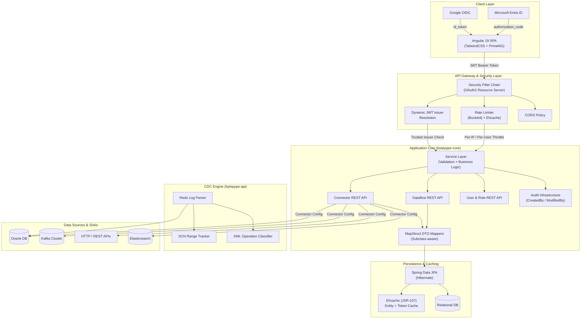
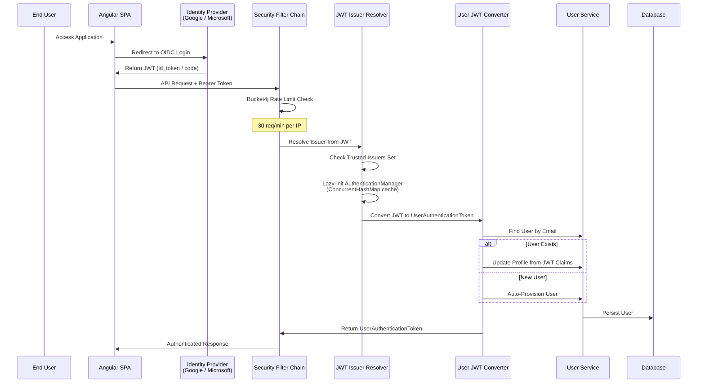
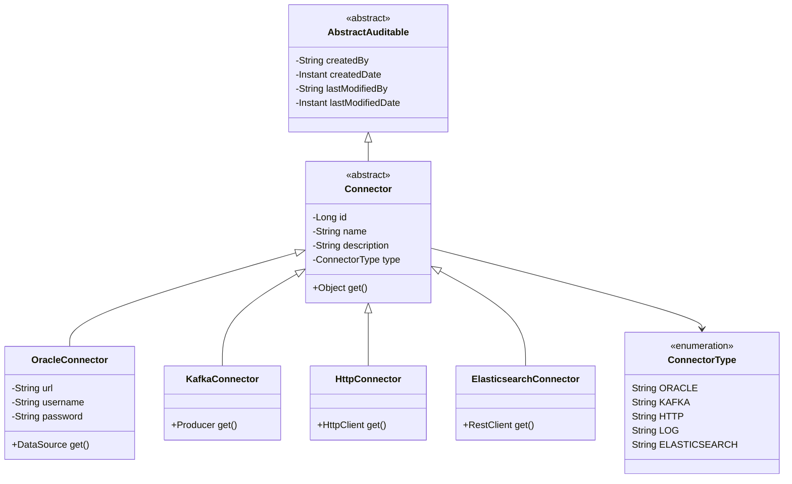

# Bytepype

A distributed, multi-tenant **Change Data Capture (CDC)** platform for building real-time data pipelines across heterogeneous data sources.

---

## What is Bytepype?

Bytepype is an open-source, self-service data pipeline platform that enables teams to visually configure, manage, and monitor real-time data flows between distributed systems — databases, message brokers, APIs, and search engines — without writing integration code.

Built with a security-first, multi-tenant architecture, Bytepype supports:
- Federated identity across multiple OAuth2/OIDC providers
- Per-tenant role-based access control
- API rate limiting out of the box

---

## Key Highlights
- **Distributed CDC Engine** — Oracle LogMiner-based redo log parsing with SCN-range tracking  
- **Multi-Tenant by Design** — Tenant-isolated connectors, dataflows, and audit trails with per-user RBAC  
- **Federated Identity** — Google and Microsoft Entra ID support with dynamic issuer resolution  
- **Pluggable Connector Architecture** — Oracle, Kafka, HTTP, Elasticsearch  
- **Single-Artifact Deployment** — Angular SPA embedded in Spring Boot JAR  
- **Production-Grade Security** — Rate limiting, CORS, JWT validation, entity-level caching  

---

## System Architecture

## Security Architecture

## Connector Inheritance & Extensibility

